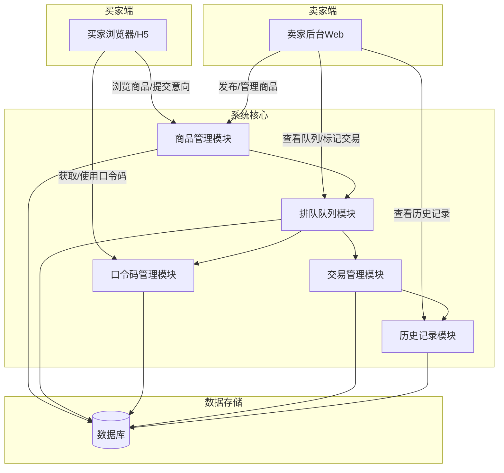
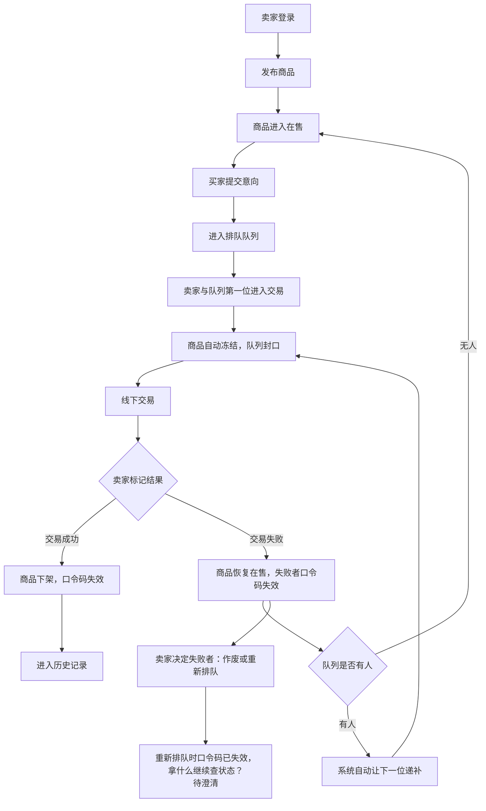
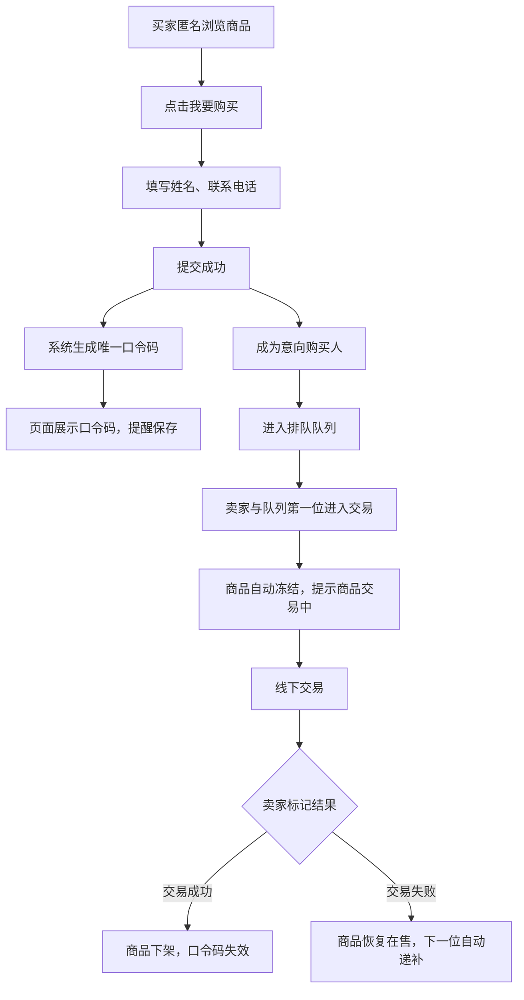
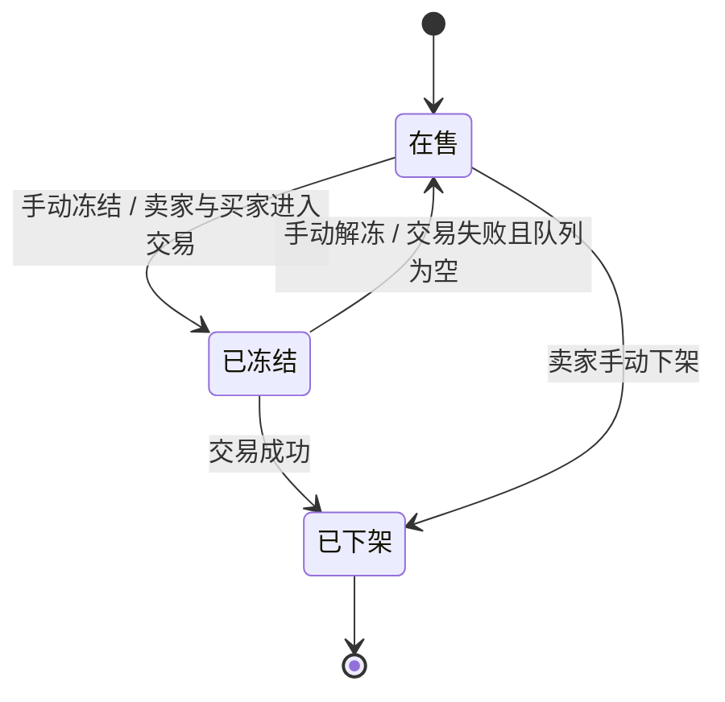
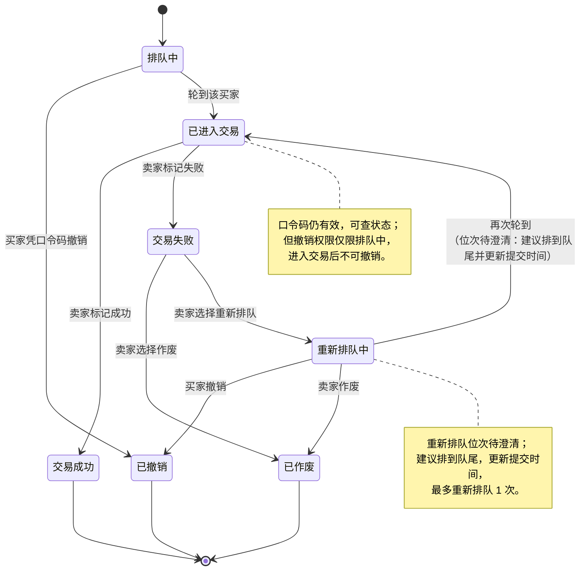
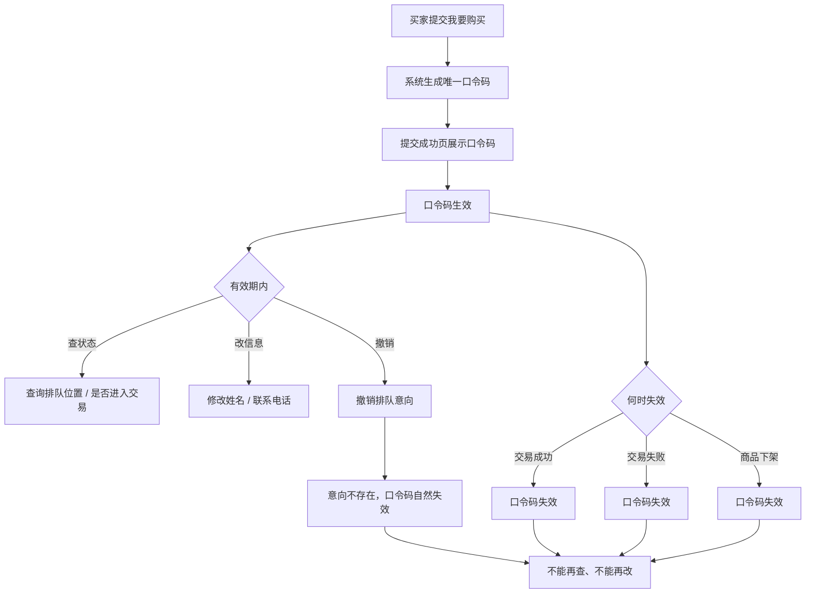
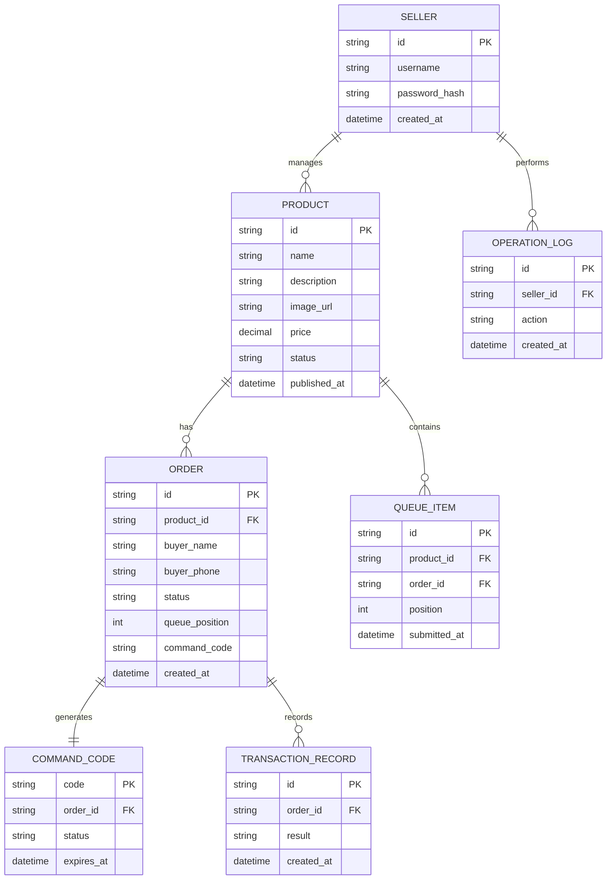

```markdown


# 在线购物系统需求分析报告


---

## 📋 文档快速导航

| 章节 | 内容 | 适用对象 |
|---|---|---|
| 第1章 | 项目概述、系统架构、业务约束 | 所有人员 |
| 第2章 | 用户角色定义与权限矩阵 | 产品、开发、测试 |
| 第3章 | 业务流程、状态机、核心规则 | 产品、开发、测试 |
| 第4章 | 详细功能需求清单 | 开发、测试 |
| 第5章 | 非功能需求（性能、安全等） | 开发、运维 |
| 第6章 | 数据模型与实体关系 | 开发、DBA |
| 第7章 | 接口需求 | 开发 |
| 第8章 | 约束与假设 | 所有人员 |
| 第9章 | 验收标准 | 测试、产品 |
| 第10章 | 风险分析 | 项目经理、开发 |
| 第11章 | 待确认项 | 产品、客户 |

---

---

## 目录

1. [项目概述](#1-项目概述)
2. [用户角色分析](#2-用户角色分析)
3. [业务流程分析](#3-业务流程分析)
4. [功能需求](#4-功能需求)
5. [非功能需求](#5-非功能需求)
6. [数据需求](#6-数据需求)
7. [接口需求](#7-接口需求)
8. [约束与假设](#8-约束与假设)
9. [验收标准](#9-验收标准)
10. [风险分析](#10-风险分析)
11. [待确认项](#11-待确认项)
12. [结论](#12-结论)

---

## 1. 项目概述

### 1.1 项目背景

本系统是一个单卖家模式的在线购物系统。卖家只有一个固定账号，无注册流程，不需要退出登录。买家无需注册、无需登录，匿名浏览商品，提交购买意向后获得唯一口令码，凭口令码查询、修改、撤销意向。交易为线下交易，一手交钱一手交货。

### 1.2 系统架构概览



### 1.3 项目目标

构建一个以“唯一卖家 + 匿名买家”为核心角色的在线购物系统，实现：

- 卖家固定账号登录后台，发布商品、管理交易、查看历史；
- 同一时间只能有一件商品在售；
- 商品发布后信息固定，不可编辑；
- 买家匿名浏览，提交购买意向，获得口令码；
- 买家按提交时间先到先得排队；
- 商品在售期间可排队，冻结后队列封口，不再收新意向；
- 卖家与队列第一位进入交易，商品自动冻结；
- 线下交易，卖家标记交易成功或失败；
- 交易成功 → 商品下架，口令码失效；
- 交易失败 → 商品恢复在售，系统自动让队列下一位递补进入交易并再次冻结；卖家决定失败者作废或重新排队；
- 历史商品保留完整交易过程，含多次失败记录；
- 口令码是买家认领意向的唯一凭证，交易结束或商品下架后失效。

### 1.4 业务约束

- 系统只有两种用户：卖家、买家。
- 卖家只有一个账号，账号固定指定，无注册流程。
- 卖家使用用户名和密码登录后台。
- 卖家后台不需要退出登录功能。
- 买家不注册、不登录、不建长期账号。
- 买家仅在购买时填写姓名和电话，信息只用于本次交易。
- 默认线下交易，一手交钱一手交货。
- 没有管理员、客服、财务、多商家等第三类角色。
- 同一时间只能有一件商品在售。
- 商品发布后，名称、描述、图片、价格均不可修改；要调整必须下架后重新发布。
- 商品在售期间可排队；一旦冻结，队列封口，不再收新意向。
- 交易顺序严格按买家提交时间先到先得，卖家不能挑人。
- 排队中的购买意向可凭口令码撤销；进入交易后不可撤销。
- 口令码是买家认领意向的唯一凭证，丢失后无法找回。
- 口令码在交易成功、交易失败、商品下架或买家主动撤销后失效。

---

## 2. 用户角色分析

### 2.1 角色定义

| 角色 | 是否有账号 | 账号来源 | 核心权限 | 说明 |
|---|---|---|---|---|
| 卖家 | 有，唯一账号 | 系统固定指定，无注册流程 | 登录后台、发布商品、查看历史商品、查看意向购买人、冻结/解冻商品、标记交易成败、作废或重新排队、修改密码 | 系统唯一后台使用者，账号预先创建；无退出登录功能；商品发布后不可编辑 |
| 买家 | 无账号 | 无 | 匿名浏览商品、提交购买意向、获取口令码、凭口令码查询/修改/撤销 | 不注册、不登录，仅填写姓名和电话，自行保存口令码 |

> 💡 **说明：** "游客"不是第三类用户，只是买家尚未提交购买意向时的浏览状态。  
> 卖家账号不是注册产生，而是系统初始化时固定写入或由部署人员预先配置。  
> 口令码不是账号、不是登录凭证，只用于认领单笔购买意向。

### 2.2 权限矩阵

| 功能 | 卖家 | 买家 |
|---|---|---|
| 浏览商品 | 可 | 可 |
| 发布商品 | 可，但同一时间只能有一件在售 | 不可 |
| 编辑商品 | 不可 | 不可 |
| 下架商品 | 可 | 不可 |
| 手动冻结/解冻商品 | 可 | 不可 |
| 查看历史商品 | 可，含多次交易失败记录 | 不可 |
| 查看历史商品意向购买人 | 可，每个买家带对应交易结果 | 不可 |
| 查看意向购买人 | 可 | 不可 |
| 查看排队队列 | 可 | 不可 |
| 调整排队顺序 | 不可 | 不可 |
| 挑选买家 | 不可 | 不可 |
| 提交购买意向 | 不可 | 可 |
| 获取口令码 | 不可 | 可，提交成功后页面显示 |
| 凭口令码查询排队位置 | 不可 | 可 |
| 凭口令码修改信息 | 不可 | 可，仅限排队中 |
| 凭口令码撤销排队意向 | 不可 | 可，仅限排队中 |
| 标记交易成功/失败 | 可 | 不可 |
| 作废当前买家意向 | 可 | 不可 |
| 重新排队当前买家 | 可 | 不可 |
| 修改密码 | 可 | 无账号 |
| 退出登录 | 不需要 | 无账号 |

---

## 3. 业务流程分析

### 3.1 卖家主流程



> **流程说明：** 卖家发布商品后，买家可提交意向并排队。卖家与第一位进入交易时商品自动冻结，交易完成后根据结果决定商品状态。

### 3.2 买家主流程



> **流程说明：** 买家匿名浏览商品，提交意向后获得口令码。凭口令码可查询排队位置、修改信息或撤销意向。交易完成后口令码失效。

### 3.3 商品状态机



| 状态 | 说明 | 可流转到 |
|---|---|---|
| 在售 | 商品展示中，可提交意向，可排队 | 已冻结、已下架 |
| 已冻结 | 手动冻结或自动冻结；商品可见，不能买，不收新意向 | 在售（手动解冻或交易失败）、已下架（交易成功） |
| 已下架 | 永久撤下，进入历史记录 | 终态 |

### 3.4 订单/意向状态机



| 状态 | 说明 | 可流转到 |
|---|---|---|
| 排队中 | 商品在售期间提交，按提交时间排队 | 已撤销、已进入交易、已作废 |
| 已撤销 | 买家凭口令码在排队阶段主动撤销 | 终态 |
| 已进入交易 | 轮到该买家，商品冻结，等待线下交易 | 交易成功、交易失败 |
| 交易成功 | 线下交易完成，口令码失效 | 终态 |
| 交易失败 | 交易未完成，口令码失效 | 已作废、重新排队中 |
| 已作废 | 卖家拒绝后直接作废，口令码失效 | 终态 |
| 重新排队中 | 卖家拒绝后选择重新排队，放回队尾 | 已进入交易、已撤销、已作废 |

### 3.5 口令码生命周期

#### 3.5.1 口令码是什么

买家提交「我要购买」之后，系统当场生成的一串唯一码，页面直接显示，提醒买家自己保存好。因为买家没注册、没账号，口令码就是买家认领自己那笔意向的唯一凭证。

#### 3.5.2 出生

买家提交购买意向成功的那一刻，系统生成唯一口令码，直接显示在「提交成功」页面。

#### 3.5.3 有效期内能做什么

| 能力 | 说明 |
|---|---|
| 查自己的意向状态 | 排到第几位、进没进交易 |
| 改自己的信息 | 姓名、联系电话都能改；改了不重新排队、位次不变 |
| 撤销意向 | 不想买了就凭码撤掉，撤了之后从队列移除，后面的人依次往前挪 |

#### 3.5.4 死亡

口令码在以下情况下作废：

| 情况 | 说明 |
|---|---|
| 交易结束——成功 | 口令码失效，不能再查、不能再改 |
| 交易结束——失败 | 口令码失效，不能再查、不能再改 |
| 商品下架 | 关联口令码失效，不能再查、不能再改 |
| 买家自己撤销意向 | 意向不存在，口令码自然失效 |

#### 3.5.5 生命周期状态表



| 阶段 | 口令码状态 | 可查状态 | 可改信息 | 可撤销 |
|---|---|---|---|---|
| 提交购买意向成功 | 生效 | 可 | 可 | 可 |
| 排队中 | 生效 | 可 | 可 | 可 |
| 已进入交易 | 生效 | 可 | 不可 | 不可 |
| 交易成功 | 失效 | 不可 | 不可 | 不可 |
| 交易失败 | 失效 | 不可 | 不可 | 不可 |
| 商品下架 | 失效 | 不可 | 不可 | 不可 |
| 买家主动撤销 | 失效 | 不可 | 不可 | 不可 |

### 3.6 冻结与解冻规则

| 项目 | 规则 |
|---|---|
| 手动冻结 | 卖家后台操作，商品变「已冻结」 |
| 自动冻结 | 卖家与买家进入交易时系统自动冻结 |
| 两种冻结的关系 | 共用同一个「已冻结」状态，对买家无区别 |
| 冻结期间能否收新意向 | 不能，一律不再接受新意向 |
| 冻结期间买家看到什么 | 商品名称、描述、图片、价格仍可见，提示「商品交易中」，无购买/提交意向入口 |
| 手动解冻 | 取消「已冻结」，商品恢复「在售」，重新挂出、重新收意向 |
| 手动解冻是否直接进入交易 | 不会。进入交易是另一回事，需卖家与某位意向购买人走到「进入交易流程」那一步 |
| 交易成功 | 商品下架，进入历史记录 |
| 交易失败 | 商品恢复在售；队列有人则自动递补并再次冻结；队列为空则保持再售 |

### 3.7 排队与递补规则

| 项目 | 规则 |
|---|---|
| 排队时机 | 商品在售期间，买家可提交意向并排队 |
| 排队顺序 | 严格按提交时间先到先得，最早提交的排最前 |
| 冻结后 | 队列封口，不再收新意向 |
| 卖家能否挑人 | 不能 |
| 卖家能否调整顺序 | 不能 |
| 交易失败后递补 | 系统自动让队列下一位递补进入交易，不需要卖家手动选人 |
| 递补后商品状态 | 再次冻结，队列再次封口 |
| 队列为空时 | 商品保持「在售」，继续接受新意向 |
| 失败者处理 | 卖家决定：作废 / 重新排队（放回队尾） |
| 失败者处理影响范围 | 只影响失败者本人，不影响下一位自动递补 |

### 3.8 买家页面展示规则

| 商品状态 | 买家看到什么 | 能否购买/提交意向 |
|---|---|---|
| 无商品在售 | 仅显示「暂无商品在售」 | 不能 |
| 在售 | 商品名称、描述、图片、价格 + 「我要购买」 | 可以 |
| 已冻结（手动或自动） | 商品名称、描述、图片、价格 + 「商品交易中」 | 不能，不收新意向 |
| 已下架 | 不展示 | 不能 |

### 3.9 卖家后台功能入口

| 入口 | 功能 | 说明 |
|---|---|---|
| 发布商品 | 发布新商品 | 仅在无在售商品时可用；名称和价格必填，描述、图片选填，图片最多一张主图 |
| 查看历史商品 | 查看已成交、已下架、交易失败过的商品 | 按时间倒序，可分页；含多次交易失败记录 |
| 查看意向购买人 | 查看当前交易中商品的意向购买人 | 显示姓名、电话、提交时间、排队序号、当前状态 |
| 冻结/解冻商品 | 切换当前商品状态 | 手动冻结/解冻，与交易冻结共用同一状态 |
| 修改密码 | 修改卖家登录密码 | 需校验旧密码，新密码长度不少于 8 位 |

> 后台不提供：商品编辑、退出登录、多卖家管理、管理员、客服、财务等功能。

---

## 4. 功能需求

> 📌 **说明：** 以下功能需求按模块分类，每个需求包含编号、角色、说明和验收标准，便于开发跟踪和测试验证。

### 4.1 商品管理

| 编号 | 需求 | 角色 | 说明 | 验收标准 |
|---|---|---|---|---|
| FR-001 | 发布商品 | 卖家 | 填写名称、价格（必填，价格必须>0，最多两位小数，单位为人民币元），描述、图片（选填，图片最多一张主图，仅支持JPG/PNG格式，单张≤5MB） | 保存后买家可见；若已有在售商品，不可发布 |
| FR-002 | 商品信息不可修改 | 系统 | 发布后名称、描述、图片、价格均不可修改 | 后台无编辑入口；修改接口被拒绝 |
| FR-003 | 下架商品 | 卖家 | 手动下架当前在售商品；要调整需下架后重新发布 | 下架后才能挂下一件，关联口令码失效 |
| FR-004 | 历史商品列表 | 卖家 | 查看已成交、已下架、交易失败过的商品 | 按时间倒序，可分页、可检索、可筛选 |
| FR-005 | 历史商品详情 | 卖家 | 查看商品快照 + 完整交易过程 | 含多次交易失败记录，不是只留最终结果 |
| FR-006 | 历史商品意向购买人 | 卖家 | 每个买家带自己那次的交易结果 | 可追溯多次失败、最终成功的全过程 |
| FR-007 | 商品快照 | 系统 | 订单生成时保存商品快照 | 历史订单可追溯 |
| FR-008 | 唯一在售 | 系统 | 同一时间只能有一件商品在售 | 尝试发布第二件时被拒绝 |

### 4.2 冻结/解冻商品

| 编号 | 需求 | 角色 | 说明 | 验收标准 |
|---|---|---|---|---|
| FR-009 | 手动冻结 | 卖家 | 将当前在售商品手动冻结 | 商品变「已冻结」，买家不能买、不能提交新意向 |
| FR-010 | 手动解冻 | 卖家 | 将手动冻结的商品恢复在售 | 商品恢复「在售」，重新收意向；不直接进入交易 |
| FR-011 | 自动冻结 | 系统 | 卖家与买家进入交易时自动冻结 | 商品变「已冻结」，队列封口 |
| FR-012 | 冻结期间不收新意向 | 系统 | 手动冻结和自动冻结均不收新意向 | 买家页面无提交入口，提示「商品交易中」 |

### 4.3 意向购买人与排队

| 编号 | 需求 | 角色 | 说明 | 验收标准 |
|---|---|---|---|---|
| FR-013 | 提交购买意向 | 买家 | 填写姓名、联系电话（必填） | 提交成功后成为意向购买人 |
| FR-014 | 生成口令码 | 系统 | 提交成功后当场生成唯一口令码 | 页面直接显示，提醒买家保存 |
| FR-015 | 排队 | 系统 | 按提交时间先到先得 | 最早提交的排最前 |
| FR-016 | 冻结后队列封口 | 系统 | 商品冻结后不再收新意向 | 新买家无法提交 |
| FR-017 | 查看意向购买人 | 卖家 | 查看姓名、电话、提交时间、排队序号、状态 | 列表可分页、筛选 |
| FR-018 | 导出意向购买人 | 卖家 | 导出 CSV | 导出字段正确 |
| FR-019 | 隐私脱敏 | 系统 | 交易完成后脱敏或删除 | 手机号不完整展示 |
| FR-020 | 不可手动调整队列 | 系统 | 卖家不能调整顺序或挑人 | 无调整入口 |
| FR-021 | 自动递补 | 系统 | 交易失败后自动让队列下一位进入交易 | 不需要卖家手动选人 |

### 4.4 订单管理

| 编号 | 需求 | 角色 | 说明 | 验收标准 |
|---|---|---|---|---|
| FR-022 | 凭口令码查询 | 买家 | 查询排队位置、是否进入交易 | 口令码有效期内可查 |
| FR-023 | 凭口令码修改信息 | 买家 | 修改姓名、联系电话 | 仅限排队中，不重新排队、位次不变 |
| FR-024 | 凭口令码撤销排队 | 买家 | 撤销排队中的意向 | 从队列移除，后面的人自动补位 |
| FR-025 | 进入交易不可撤销 | 系统 | 商品冻结后买家不可撤销 | 撤销入口不可用 |
| FR-026 | 口令码失效 | 系统 | 交易成功、交易失败、商品下架或买家撤销后失效 | 失效后不可查、不可改 |
| FR-027 | 交易标记 | 卖家 | 标记交易成功或失败 | 商品状态同步 |
| FR-028 | 交易成功 | 系统 | 商品下架，口令码失效，进入历史记录 | 商品永久撤下 |
| FR-029 | 交易失败 | 系统 | 商品恢复在售；队列有人则自动递补并再次冻结 | 队列为空则保持再售 |
| FR-030 | 失败者处理 | 卖家 | 决定失败者作废或重新排队 | 只影响失败者本人，不影响自动递补 |
| FR-031 | 多次交易记录 | 系统 | 同一商品多次交易失败后成功，全部记录保留 | 历史商品详情可查每一轮交易结果 |

### 4.5 卖家后台

| 编号 | 需求 | 角色 | 说明 | 验收标准 |
|---|---|---|---|---|
| FR-032 | 卖家登录 | 卖家 | 固定账号 + 用户名和密码登录 | 登录成功，失败有提示 |
| FR-033 | 卖家账号不可注册 | 系统 | 无卖家注册入口 | 前台/后台均无注册卖家功能 |
| FR-034 | 无退出登录 | 系统 | 卖家后台不提供退出登录功能 | 后台无退出登录入口 |
| FR-035 | 修改密码 | 卖家 | 旧密码校验后修改，新密码长度不少于 8 位 | 修改成功 |
| FR-036 | 发布商品 | 卖家 | 名称、价格必填（价格必须>0，最多两位小数，单位为人民币元）；描述、图片选填，图片最多一张主图（仅支持JPG/PNG格式，单张≤5MB） | 已有在售商品时不可发布 |
| FR-037 | 查看历史商品 | 卖家 | 列表展示名称、描述、图片、价格、发布时间、交易结果、交易时间 | 按时间倒序，可分页、可检索、可筛选 |
| FR-038 | 查看历史商品详情 | 卖家 | 商品快照 + 意向购买人列表 | 每个买家带对应交易结果，多次失败记录全部保留 |
| FR-039 | 查看意向购买人 | 卖家 | 当前交易中商品的意向购买人列表 | 显示姓名、电话、提交时间、排队序号、状态 |
| FR-040 | 冻结/解冻商品 | 卖家 | 手动切换商品状态 | 冻结后不收新意向；解冻后恢复在售 |
| FR-041 | 修改密码 | 卖家 | 旧密码校验后修改，新密码长度不少于 8 位 | 修改成功 |
| FR-042 | 操作日志 | 系统 | 记录卖家关键操作 | 日志可查 |

### 4.6 买家端

| 编号 | 需求 | 角色 | 说明 | 验收标准 |
|---|---|---|---|---|
| FR-043 | 匿名浏览 | 买家 | 无需注册登录即可浏览商品 | 可查看名称、描述、图片、价格 |
| FR-044 | 无商品在售 | 系统 | 仅显示「暂无商品在售」 | 不展示商品信息 |
| FR-045 | 商品在售 | 系统 | 显示商品信息 + 「我要购买」 | 可提交意向 |
| FR-046 | 商品冻结 | 系统 | 显示商品信息 + 「商品交易中」 | 不能购买，不能提交意向 |
| FR-047 | 提交购买意向 | 买家 | 填写姓名、联系电话（必填） | 提交成功生成口令码 |
| FR-048 | 口令码展示 | 系统 | 提交成功页面直接显示口令码 | 提醒买家自行保存 |
| FR-049 | 凭口令码查询/修改/撤销 | 买家 | 查询排队位置、修改姓名电话、撤销排队意向 | 仅限口令码有效期内、排队中 |
| FR-050 | 口令码丢失 | 系统 | 丢失后无法找回 | 页面明确提示 |

### 4.7 终端需求

| 编号 | 需求 | 说明 | 验收标准 |
|---|---|---|---|
| FR-051 | 卖家后台 Web | 卖家管理主入口 | 核心功能可用 |
| FR-052 | 买家 Web/H5 | 浏览、购买、获取口令码、凭口令码查询/撤销 | 响应式适配，口令码提交成功页展示 |

> 终端范围最终以“待确认项”为准。本版本默认先做 Web / H5。

### 4.8 Scrum 过程需求

| 编号 | 需求 | 说明 | 验收标准 |
|---|---|---|---|
| FR-053 | Product Backlog | 所有特性粗略描述与估算 | 包含全部需求 |
| FR-054 | Sprint Backlog | 细化到小时，单任务 ≤ 16 小时 | 成员签名认领 |
| FR-055 | Sprint 评审 | 每 Sprint 评审 | 有记录 |
| FR-056 | Sprint 回顾 | 每 Sprint 回顾 | 有改进项 |
| FR-057 | 每日站会 | 同步进度 | 有站会记录 |

---

## 5. 非功能需求

| 编号 | 类别 | 需求 |
|---|---|---|
| NFR-001 | 性能 | 商品详情响应小于 2 秒 |
| NFR-002 | 安全 | 密码哈希存储，HTTPS，防 CSRF、XSS、SQL 注入 |
| NFR-003 | 隐私 | 买家姓名、电话仅用于本次交易，交易后脱敏或删除 |
| NFR-004 | 口令码安全 | 口令码随机、不可猜测、唯一，不可枚举 |
| NFR-005 | 口令码失效 | 交易成功、交易失败、商品下架或买家撤销后立即失效 |
| NFR-006 | 卖家账号安全 | 固定账号，密码哈希存储，支持修改密码 |
| NFR-007 | 可用性 | 系统可用性不低于 99% |
| NFR-008 | 兼容性 | 支持主流浏览器；移动端适配以最终终端范围为准 |
| NFR-009 | 可维护性 | 模块化、接口文档、日志规范 |
| NFR-010 | 审计 | 卖家关键操作可追溯，历史交易过程完整保留 |
| NFR-011 | 备份 | 数据库定期备份，可恢复 |
| NFR-012 | 图片 | 限制格式（仅支持JPG/PNG）、大小（单张≤5MB），防止恶意上传；最多一张主图 |
| NFR-013 | 并发 | 商品冻结、排队、递补需保证顺序一致性，防止超卖 |
| NFR-014 | 先到先得 | 队列顺序严格按提交时间，不可人为干预 |
| NFR-015 | 历史完整性 | 同一商品多次交易记录必须完整保留，不可只存最终结果 |

---

## 6. 数据需求

### 6.1 实体关系图



### 6.2 主要实体

| 实体 | 说明 |
|---|---|
| 卖家 | 唯一固定账号，含用户名、密码哈希；系统初始化时写入；无退出登录 |
| 商品 | 名称、描述、图片、价格、状态；同一时间只能有一条在售；发布后不可编辑 |
| 商品图片 | 最多一张主图 |
| 订单/意向单 | 订单号、商品快照、买家姓名、电话、状态、排队序号、口令码、提交时间、口令码状态、交易结果 |
| 买家交易信息 | 仅本次交易姓名、电话，不建账号表 |
| 排队队列 | 商品 ID、订单 ID、排队序号、提交时间、状态 |
- 交易完成后按隐私策略处理买家信息。
- 商品快照与订单绑定，保证历史可追溯。
- 排队队列需保证先进先出，严格按提交时间排序，撤销后自动补位。
- 口令码全局唯一，与订单一一对应，作为买家认领意向的唯一凭证。
- 口令码需记录状态：生效、失效；失效后不可再用于查询、修改、撤销。
- 同一时间只允许一条商品记录处于“在售”状态。
- 卖家表只有一条记录，账号固定指定，无注册流程。
- 历史商品需保留同一商品的多轮交易记录，包括每次失败、重新排队、最终成功的完整链路。
- 历史商品详情页的意向购买人列表，每个买家带自己那次的交易结果。

---

## 7. 接口需求

| 接口类型 | 说明 |
|---|---|
| 公开接口 | 商品列表、商品详情；无商品在售时返回空状态；冻结商品返回商品信息 + 交易中标记 |
| 买家接口 | 提交购买意向并返回口令码、凭口令码查询、修改、撤销 |
| 卖家接口 | 登录、发布商品、下架商品、历史商品（含多次交易记录）、意向购买人、冻结/解冻、标记交易、作废/重新排队、修改密码 |
| 文件接口 | 图片上传 |

---

## 8. 约束与假设

1. 系统只有卖家和买家两种用户。
2. 卖家只有一个账号，账号固定指定，无注册流程。
3. 卖家使用用户名和密码登录后台，后台不提供退出登录功能。
4. 买家不注册、不登录、不建长期账号。
5. 买家提交购买意向后，系统当场生成唯一口令码，并在提交成功页面直接显示。
6. 买家自行保存口令码，后续查询、修改、撤销全靠口令码。
7. 口令码丢失后无法找回，页面必须明确提示。
8. 口令码在交易成功、交易失败、商品下架或买家主动撤销后失效。
9. 同一时间只能有一件商品在售；卖掉或手动下架后才能挂下一件。
10. 商品发布后信息固定，不可编辑；要调整就下架后重新发布。
11. 商品在售期间可排队；一旦冻结，队列封口，不再收新意向。
12. 手动冻结和自动冻结共用同一个「已冻结」状态，对买家无区别。
13. 冻结期间一律不收新意向。
14. 手动解冻只恢复在售，与交易无关。
15. 交易顺序严格按提交时间先到先得，卖家不能挑人，不能手动调整队列。
16. 卖家与队列第一位进入交易时，商品自动冻结。
17. 交易成功 → 商品下架，口令码失效，进入历史记录。
18. 交易失败 → 商品恢复在售；队列有人则系统自动让下一位递补进入交易并再次冻结；队列为空则保持再售。
19. 失败者处理由卖家决定：作废或重新排队；只影响失败者本人，不影响自动递补。
20. 历史商品保留完整交易过程，多次失败记录不可只留最终结果。
21. 历史商品详情页的意向购买人列表，每个买家带自己那次的交易结果。
22. 无商品在售：买家页面仅显示「暂无商品在售」。
23. 商品冻结：买家仍可看到商品信息，但不能购买，提示「商品交易中」。
24. 口令码不是账号、不是登录凭证，只用于认领单笔购买意向。
25. 免责声明：系统仅提供交易撮合与信息管理功能，所有交易均为线下进行，系统不对线下交易的真实性、商品质量、交易纠纷等承担任何责任。

---

## 9. 验收标准

| 编号 | 验收项 | 标准 |
|---|---|---|
| AC-001 | 卖家登录 | 固定账号 + 用户名密码登录，无注册入口，无退出登录 |
| AC-002 | 买家浏览 | 匿名可查看商品名称、描述、图片、价格 |
| AC-003 | 无商品在售 | 页面仅显示「暂无商品在售」 |
| AC-004 | 商品冻结 | 显示商品信息，不能购买，提示「商品交易中」，不收新意向 |
| AC-005 | 买家提交意向 | 填姓名、电话后生成意向单 |
| AC-006 | 口令码展示 | 提交成功页面直接显示口令码，提示自行保存 |
| AC-007 | 口令码用途 | 可查排队位置、修改姓名电话、撤销排队意向 |
| AC-008 | 口令码非账号 | 不能登录后台，不能查看他人意向，丢失不可找回 |
| AC-009 | 排队 | 按提交时间先到先得，最早提交者排最前 |
| AC-010 | 冻结前可排队 | 商品在售期间，多个买家可提交意向并排队 |
| AC-011 | 冻结后封口 | 商品冻结后不再收新意向 |
| AC-012 | 卖家不可挑人 | 卖家后台无选择买家、调整队列入口 |
| AC-013 | 排队撤销 | 买家凭口令码可撤销排队意向 |
| AC-014 | 队列补位 | 撤销后后面买家自动前移 |
| AC-015 | 进入交易不可撤销 | 商品冻结后买家撤销入口不可用 |
| AC-016 | 手动冻结 | 卖家可手动冻结在售商品，冻结后不收新意向 |
| AC-017 | 手动解冻 | 手动解冻后商品恢复在售，重新收意向，不直接进入交易 |
| AC-018 | 自动冻结 | 卖家与买家进入交易时商品自动冻结，队列封口 |
| AC-019 | 交易成功 | 卖家标记成功，商品下架，口令码失效，进入历史记录 |
| AC-020 | 交易失败 | 卖家标记失败，商品恢复在售，队列有人则自动递补并再次冻结 |
| AC-021 | 自动递补 | 系统自动让队列下一位进入交易，不需要卖家手动选人 |
| AC-022 | 失败者处理 | 卖家决定作废或重新排队，只影响失败者本人 |
| AC-023 | 队列为空 | 交易失败后队列为空，商品保持再售，继续收新意向 |
| AC-024 | 商品下架 | 关联口令码失效，不能再查状态或改信息 |
| AC-025 | 唯一在售 | 同一时间只能有一件商品在售，发布第二件被拒绝 |
| AC-026 | 商品不可编辑 | 后台无编辑入口，发布后名称、描述、图片、价格不可改 |
| AC-027 | 卖家后台 | 可发布、查看历史、查看意向购买人、冻结/解冻、改密、作废/重新排队 |
| AC-028 | 历史商品列表 | 按时间倒序，可分页，展示名称、描述、图片、价格、发布时间、交易结果、交易时间 |
| AC-029 | 历史商品详情 | 显示商品快照 + 完整交易过程，多次失败记录全部保留 |
| AC-030 | 历史意向购买人 | 每个买家带姓名、电话、提交时间、对应交易结果 |
| AC-031 | 多次交易追溯 | 多次失败后成功的全过程可查，不是只留最终结果 |
| AC-032 | Scrum | 产出 Product Backlog、Sprint Backlog、评审回顾记录 |

---

## 10. 风险分析

| 风险 | 影响 | 应对 |
|---|---|---|
| 买家信息隐私 | 合规风险 | 最小化收集，交易后脱敏 |
| 口令码丢失 | 买家无法认领意向 | 提交成功页强提示保存，不提供找回 |
| 口令码失效时机 | 买家无法查询 | 明确失效规则，页面提示失效原因 |
| 冻结与队列并发 | 顺序错乱或超卖 | 数据库锁 + 状态机 + 事务 |
| 自动递补并发 | 递补顺序错误 | 队列序号 + 提交时间 + 事务 |
| 历史记录完整性 | 多次交易过程丢失 | 订单与历史表分离，每次交易单独记录，不可覆盖 |
| 唯一在售限制 | 卖家无法同时卖多件 | 明确业务规则，前端后端双重校验 |
| 卖家账号固定 | 无法多卖家扩展 | 明确单卖家模式，不提供注册入口 |

---

## 11. 待确认项

以下内容尚未最终确认，不纳入本期范围；确认后再补充到后续版本。

| 编号 | 待确认项 | 说明 |
|---|---|---|
| TBD-01 | 评价功能 | 是否保留？若保留，交易成功后口令码立即失效，买家何时评价？ |
| TBD-02 | 卖家“进入交易”操作 | 是否只能对队列第一位使用？卖家能否一直不点？是否有超时自动进入？ |
| TBD-03 | 重新排队口令码 | 交易失败后口令码按最新规则失效；重新排队时是生成新口令码，还是原码继续有效？ |
| TBD-04 | 支付管理 | 线上支付、退款、对账是否纳入？ |
| TBD-05 | 配送管理 | 自提、卖家配送、物流是否纳入？ |
| TBD-06 | 营销管理 | 优惠券、满减、秒杀、拼团是否纳入？ |
| TBD-07 | 库存管理 | 库存数量、预警是否纳入？ |
| TBD-08 | 多图/分类/SKU | 是否纳入？当前规则为最多一张主图 |
| TBD-09 | 通知 | 站内信、短信、推送是否纳入？ |
| TBD-10 | 统计报表 | 销售、库存、客户报表是否纳入？ |
| TBD-11 | 终端范围 | Web、Android、iOS、微信小程序是否全做？ |
| TBD-12 | 团队与工期 | 团队人数、总工期、Sprint 长度、每人每周投入 |
| TBD-13 | 验收方式 | 谁验收、必须演示哪些端到端流程 |
| TBD-14 | 交付物 | 源码、文档、部署、演示视频是否都要 |

---

## 12. 结论

### 12.1 核心角色总结

本系统最终角色只有两类：

1. **卖家**：唯一固定账号，系统初始化时指定，无注册流程，无退出登录。使用用户名和密码登录后台，发布和管理当前唯一在售商品，查看历史商品和意向购买人，手动冻结/解冻商品，标记交易成败，决定失败者作废或重新排队，修改密码。卖家不能挑选买家，不能调整队列顺序，不能编辑已发布商品。
2. **买家**：无账号，匿名浏览，提交购买意向时填写姓名和电话，信息仅用于本次交易。提交成功后获得唯一口令码，自行保存，后续凭口令码查询排队位置、修改姓名电话、撤销排队意向。

### 12.2 关键交易规则总结

| 规则类别 | 核心要点 |
|---|---|
| 账号管理 | 卖家账号固定指定，无注册流程，单卖家模式，无退出登录 |
| 商品管理 | 同一时间只能有一件商品在售，发布后信息不可编辑 |
| 排队机制 | 按提交时间先到先得，卖家不能挑人或调整顺序 |
| 冻结机制 | 进入交易时自动冻结，手动冻结/解冻共用同一状态 |
| 交易流程 | 成功→下架；失败→恢复在售+自动递补 |
| 口令码 | 交易成功/失败/下架/撤销后失效，丢失不可找回 |
| 历史记录 | 保留完整交易过程，多次失败记录不可只留最终结果 |


### 12.3 总结

本系统以"唯一卖家 + 匿名买家"为核心模式，通过口令码机制实现无账号交易，通过排队递补机制保证公平性，通过完整历史记录保证可追溯性。系统设计简洁、规则明确，适合单卖家线下交易场景。